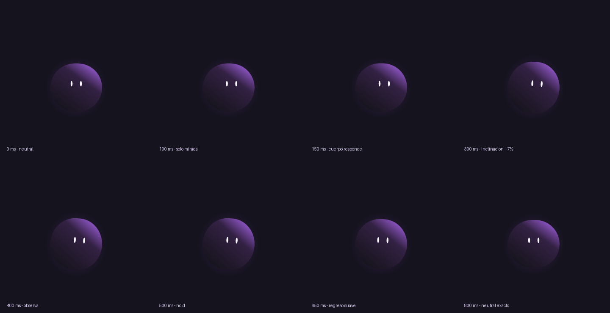

# Mini JEV: una anatomía, dos animaciones verificables

Laboratorio independiente de Rive CLI 1.3.0 + RML. El mismo pequeño orbe oscuro con luz violeta y dos ojos expresa alegría con `happy_bounce` (750 ms) y curiosidad tranquila con `curious_look` (800 ms). Ambas regresan exactamente a neutral. Todo vive en esta carpeta; no requiere la aplicación principal, Node, un LLM ni login de Rive.

## Fase 3: probar teclado y recuperación en navegador

Desde la raíz del repositorio, en PowerShell:

```powershell
python ./jev-lab/validators/preview.py
```

Abre [Mini JEV local](http://127.0.0.1:4180/). El servidor permanece abierto hasta `Ctrl+C`. Si ese puerto está ocupado, usa `python ./jev-lab/validators/preview.py --port 4181` y abre `http://127.0.0.1:4181/`.

Este preview inicia exactamente neutral y sigue el cursor. Los ojos reaccionan suavemente antes del cuerpo; al salir, vuelve a neutral y deja de programar frames. Tocar o hacer clic sobre el cuerpo reproduce `happy_bounce` una vez; el botón **Curiosidad** reproduce `curious_look` una vez. También puedes enfocar a JEV con Tab y pulsar Enter o Espacio para alegrarlo. No hay autoplay ni state machine. **Las fases 1 y 2 están aprobadas; esta fase 3 está lista técnicamente y espera tu prueba personal y confirmación final.**

Prueba manual:

1. Abre o recarga: JEV debe estar quieto, neutral y sin autoplay.
2. Mueve el cursor a derecha, izquierda, arriba y abajo: mirada suave y pequeña inclinación; los ojos deben responder antes que el cuerpo.
3. Sal del área del personaje: debe descansar exactamente neutral, sin deriva.
4. Cambia el tamaño de la ventana: debe mantenerse visible y seguir el cursor correctamente, incluso con márgenes a los lados o arriba/abajo.
5. Haz clic o toca el cuerpo: debe saltar durante 750 ms y regresar exactamente a neutral. Tocar el fondo, halo o esquinas exteriores no debe activarlo.
6. Pulsa **Curiosidad**: ojos a la derecha primero, cuerpo después; retorno suave en 800 ms. El botón se deshabilita durante la reacción.
7. Repite clics durante una reacción: deben ignorarse, sin reiniciar ni dejar acciones pendientes. Mueve el cursor mientras se reproduce: el seguimiento debe retomarse suavemente después de un frame neutral.
8. Usa Tab para enfocar a JEV: debe aparecer un borde de foco visible. Enter o Espacio deben activar alegría; Espacio no debe desplazar la página. Mantener la tecla pulsada no debe reiniciar ni encolar reacciones. Otras teclas no deben activar nada. En el botón Curiosidad, Enter/Espacio conservan su comportamiento normal.
9. Cambia a otra pestaña durante una reacción y vuelve: JEV debe aparecer exactamente neutral, sin continuar ni repetir el clip. Debe quedarse quieto hasta una nueva interacción.
10. Prueba una ventana estrecha y otra ancha, incluyendo zoom o una pantalla de diferente resolución: JEV debe seguir visible, con mirada acotada y clics correctos sobre su cuerpo.
11. Confirma esta fase después de probarla; la aprobación personal final sigue pendiente.

La prueba automática del navegador integrado confirmó teclado, foco, clics rápidos y resize. Ese navegador mantiene `document.hidden=false` al cambiar de pestaña; por tanto, la suspensión real aún debe probarse en un navegador convencional cambiando de pestaña o minimizando. Sus transiciones y restauración neutral sí pasan los tests del controlador.

La configuración de seguimiento está en `web/follow.json`: ojos ±8 px horizontal y ±5 px vertical respecto a su pose inicial, cuerpo ±2°, respuesta exponencial de 70 ms para ojos y 140 ms para cuerpo. El controller comprueba esos límites contra el contrato corporal existente. Solo escribe mirada x/y e inclinación; conserva posición, escalas, dimensiones y blink neutrales. La conversión del cursor usa coordenadas CSS con `contain` centrado; DPR afecta únicamente la resolución del dibujo.

`web/action.mjs` mantiene un único dueño de las transformaciones: seguimiento en reposo, timeline durante la reacción y un frame neutral antes de retomar el cursor más reciente. Los primeros 80 ms mezclan la pose capturada con el clip, dentro de su duración original; cada frame restaura esa captura antes de aplicar el mix, evitando acumulación. Se usan directamente `LinearAnimationInstance` y los clips existentes, sin modificar sus tiempos ni crear Preview StateMachine. El hit test invierte las transformaciones actuales y comprueba el rectángulo redondeado del cuerpo, sin incluir su halo.

El canvas tiene semántica de botón, foco por teclado y etiqueta accesible. Solo acepta Enter/Espacio cuando está enfocado; bloquea la repetición de teclas. Al ocultar la página se cancela el frame pendiente, se libera el clip activo y se restauran los 20 campos neutrales. Al volver se dibuja esa pose y no se reanuda ninguna acción anterior. `data-visibility` y `data-cancellation-count` permiten verificar esa transición sin añadir controles visibles.

El servidor comprueba que `main.rml` esté actualizado sin modificarlo, compila con Rive CLI y copia el runtime ya instalado `@rive-app/canvas` 2.42.2 a `output/tools/browser/` (ignorado por Git). No instala paquetes ni cambia dependencias. Sirve únicamente archivos dentro de `jev-lab`, desde localhost; no usa una CDN para cargar JS/WASM. Al cerrar la página cancela frames, retira listeners y libera los recursos Rive, incluidas las instancias de animación. El diagnóstico DOM `#diagnostics` permite comprobar pose, neutral y programación de frames sin añadir controles técnicos visibles. `data-last-neutral-pose`, `data-last-neutral-frame`, `data-last-completed-animation`, `data-last-completed-duration` y `data-neutral-transition-count` registran los 20 campos y el frame neutral después de dibujarlo, aunque el seguimiento ya se haya retomado.

Verificación automática desde la raíz:

```powershell
node --test ./jev-lab/tests/test_controller.mjs ./jev-lab/tests/test_action.mjs
python -m unittest discover -s ./jev-lab/tests -v
python ./jev-lab/validators/build.py --check
& ./jev-lab/output/tools/rive.exe ./jev-lab/rive --verify --format=json
& ./jev-lab/output/tools/rive.exe inspect ./jev-lab/rive --summary
```

Evidencia actual: `output/phase3/validation-report.md`; los informes y capturas anteriores permanecen en `output/phase1/` y `output/phase2/`. Las animaciones, specs, anatomía y selección RML previas se preservan.



## Animaciones RML previas: abrir el preview nativo

Desde la raíz del repositorio, en PowerShell:

```powershell
cd ./jev-lab
$r = './output/tools/rive.exe'
& $r --version                       # rive 1.3.0
python ./validators/build.py --animation curious_look
& $r ./rive --fit=contain
```

Este comando abre el preview nativo y reproduce automáticamente `curious_look` una vez. Cierra la ventana y repite el último comando para repetirlo. En su terminal, `p` pausa/reanuda. La CLI vigila y recarga `main.rml`; al editar fragmentos, ejecuta el ensamblador en otra terminal para actualizarlo. No existe un subcomando `preview` o `build` en esta versión.

Para volver a `happy_bounce`, cierra el preview y ejecuta:

```powershell
python ./validators/build.py --animation happy_bounce
& $r ./rive --fit=contain
```

Ambas animaciones siempre quedan en la escena compilada; `rive/preview.json` selecciona cuál arranca. `build.py` sin argumentos conserva esa selección. `--check` verifica el resultado correspondiente sin cambiarla. Para regresar a curiosidad, ejecuta otra vez `build.py --animation curious_look`.

## Validar y renderizar

En `jev-lab`, con el mismo `$r`:

```powershell
python ./validators/build.py --animation curious_look
python ./validators/build.py --check --animation curious_look
& $r ./rive --verify --format=json
& $r ./rive --once --format=json
& $r inspect ./rive --summary
python ./validators/validate.py
python -m unittest discover -s ./tests -v
& $r ./rive --test --format=json
& $r ./rive --screenshot=./output/curious_look/hold.png --advance=400ms
& $r ./rive --screenshot=./output/curious_look/final.png --advance=800ms
python ./validators/render.py --animation curious_look
```

En PowerShell, comprueba `$LASTEXITCODE` después de cada comando (0 significa éxito). `validate.py` comprueba **ambas** animaciones y consulta `inspect` real. Con curiosidad seleccionada guarda `output/curious_look/validation.json` e `inspect.json`; con alegría seleccionada usa `output/`. Verifica identidad, anatomía, pistas permitidas, valores finitos, easing, neutral, escalas locales/compuestas, ojos dentro de la cara y visibilidad. Evalúa 363 tiempos para happy y 387 para curious, a intervalos de 1/8 de frame, incluyendo claves y tiempos posteriores al final. También exige retraso corporal de 80–120 ms, stretch de 5–10%, hold breve y ojos sin sorpresa en curiosidad. Los controles cúbicos monótonos acotan cada pista entre claves; los límites geométricos compuestos se comprueban por muestreo, no por una prueba matemática exhaustiva.

Los tests Python son la suite del contrato. `--test` de Rive termina sin errores pero informa `noTestsFound: true`, porque este proyecto no contiene scripts `Tests`; no representa tests de animación aprobados.

`render.py` necesita Pillow, instalado en el Python de este entorno. Ensamblado, validación y tests usan solo la biblioteca estándar. Las capturas individuales solo necesitan Rive. Para curiosidad genera 18 PNG reales, GIF, contact sheet y comparación RGBA: 800 ms y 1000 ms deben ser exactamente iguales a neutral; ojos y cuerpo deben aparecer en cada captura. Todos esos productos quedan en `output/curious_look/`, preservando renders e informes anteriores de happy. El tick de entrada de la state machine se absorbe manteniendo neutral durante los últimos dos frames (46–48 en curious; 43–45 en happy).

Si falta Pillow, instala únicamente dentro del laboratorio y usa ese Python para renders:

```powershell
python -m venv ./output/tools/python-env
& ./output/tools/python-env/Scripts/python.exe -m pip install Pillow
& ./output/tools/python-env/Scripts/python.exe ./validators/render.py --animation curious_look
```

## CLI portable en Windows

El ejecutable oficial ya está en `output/tools/rive.exe` y queda disponible localmente, aunque se excluye de Git. Para reconstruir esa instalación desde una copia nueva, ejecuta dentro de `jev-lab`:

```powershell
New-Item -ItemType Directory -Force ./output/tools | Out-Null
$archive = './output/tools/rive-windows-x64-1.3.0.tar.gz'
Invoke-WebRequest 'https://releases.rive.app/cli/v1.3.0/rive-windows-x64.tar.gz' -OutFile $archive
$expected = 'f83ac81a28c53668bd4193579dc636f0286bdd044cf6b3f7393a199764f5aeef'
if ((Get-FileHash $archive -Algorithm SHA256).Hash.ToLower() -ne $expected) { throw 'SHA-256 de Rive CLI incorrecto' }
tar -xzf $archive -C ./output/tools
$r = './output/tools/rive.exe'
& $r --version
```

Consulta sintaxis en la CLI instalada antes de ampliarla:

```powershell
& $r docs format
& $r docs easing
& $r docs state-machines
& $r schema Node --animatable
& $r schema Rectangle --animatable
& $r schema LinearAnimation --all --json
```

## Fuentes y productos

```text
jev-lab/
  README.md, AGENTS.md, JEV_BODY_CONTRACT.md, JEV_MOTION_RULES.md
  rive/
    rive.yaml
    preview.json                     selección persistida del preview
    main.rml                         escena completa generada/revisable
    character/body_contract.json     autoridad numérica
    character/body.rml               anatomía generada/revisable
    animations/happy_bounce.rml       implementación de movimiento
    animations/curious_look.rml
    animations/catalog.json          IDs y límites por animación
  specs/happy_bounce.json, curious_look.json
  validators/build.py, validate.py, render.py
  tests/test_validator.py, test_curious_look.py
  output/
    research.md, validation.json, render-validation.json, tests.txt
    verify.json, build.json, cli-tests.json, inspect.json, inspect-summary.json
    neutral.png, apex.png, final.png, post-final.png
    contact-sheet.png, happy_bounce.gif, frames/, render.log
    curious_look/                     renders, GIF y validaciones de segunda fase
    build/mini_jev.riv, tools/rive.exe  productos locales ignorados por Git
```

## Decisiones y límites

- El ensamblador Python importa hijos XML reales del cuerpo y las dos animaciones bajo el artboard. Es código propio: RML no ofrece un Include o macro usado aquí. `rive.yaml` excluye las carpetas de fragmentos para evitar duplicados. Dividir objetos como raíces con referencias sueltas parecía válido en inspect pero falló al exportar; la escena ensamblada sí compila.
- `body_contract.json` fija medidas, neutrales, límites e IDs; el validador permite solo pistas específicas. Para otra animación se necesita primero una nueva spec y una ampliación consciente de esta fase.
- La CLI es un technical preview; fijamos 1.3.0. `--once` produce un `.riv` sin firmar. Preview nativo, PNG y el nuevo navegador local con canvas 2.42.2 funcionan sin cuenta. Publicación/CDN siguen sin verificar; no agregamos integración de producción.
- La inspección devuelve estructura resuelta, no poses animadas a tiempo t. Combinamos fuente, inspect, muestreo y renders. Evidencia histórica de happy: `output/validation-report.md`. Segunda fase: `output/curious_look/validation-report.md`. El fragmento/spec de happy y la anatomía base se conservaron sin cambios.

Contexto del JEV original, comandos investigados y fuentes oficiales: [`output/research.md`](output/research.md). Contrato detallado: [`JEV_BODY_CONTRACT.md`](JEV_BODY_CONTRACT.md); personalidad y timing: [`JEV_MOTION_RULES.md`](JEV_MOTION_RULES.md).
